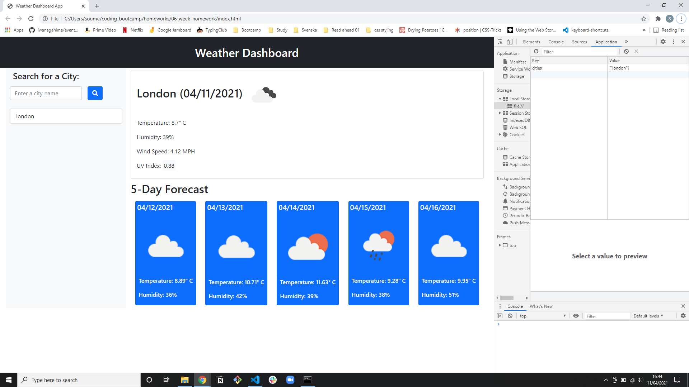

# Weather Dashboard

## Table of Contents

- [Weather Dashboard](#weather-dashboard)
  - [Table of Contents](#table-of-contents)
  - [Github Pages URL](#github-pages-url)
  - [Description](#description)
    - [What Was Done](#what-was-done)
  - [Screenshot](#screenshot)
    - [Screenshot with Local Storage](#screenshot-with-local-storage)

## Github Pages URL

https://soumeyah.github.io/weather_dashboard/

## Description

We were tasked with creating a weather app using the third party API OpenWeather API

### What Was Done

- Added a search bar for user to input city name to search
- Use the openweather and onecall api to fetch
  - Current day data:
    - city name, date, icon representing weather, temp, humidity, wind speed, UV index
  - 5 Day forecast
    - city name, date, icon representing weather, temp, humidity
- Dynamically rendered using jQuery
- Styled using Bootstrap

## Screenshot

### Screenshot with Local Storage

